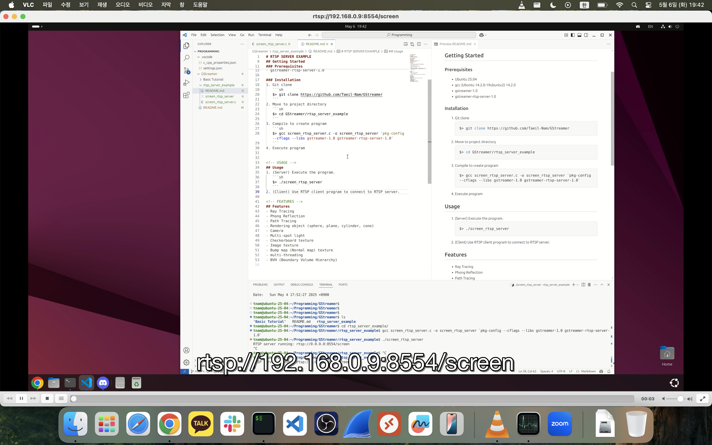

# RTSP SERVER EXAMPLE

<!-- FEATURES -->
## Features
- Live stream of the screen via RTSP server.

<!-- LIMITATION -->
## Limitation
- Works only with the X11 server.
- Uses H.264 encoding.

<!-- GETTING STARTED -->
## Getting Started

### Prerequisites
- Ubuntu 25.04
- gcc (Ubuntu 14.2.0-19ubuntu2) 14.2.0
- gstreamer-1.0
- gstreamer-rtsp-server-1.0

### Installation
1. Git clone
   ```sh
   $> git clone https://github.com/gstreamer101/gst-dynamic-recorder.git
   ```
2. Move to project directory
   ```sh
   $> cd gst-dynamic-recorder/examples/rtsp_server_example
   ```
3. Compile the program
   ```sh
   $> gcc screen_rtsp_server.c -o screen_rtsp_server `pkg-config --cflags --libs gstreamer-1.0 gstreamer-rtsp-server-1.0`
   ```

<!-- USAGE -->
## Usage
1. (Server) Execute the program.
   ```sh
   $> ./screen_rtsp_server
   ```
2. (Client) Connect to the RTSP server using any RTSP-compatible client.
    ```
    URL to connect = rtsp://[RTSP Server IP]:8554/screen
    Ex) rtsp://192.168.0.9:8554/screen
    ```
    [Example using VLC media player]
    
